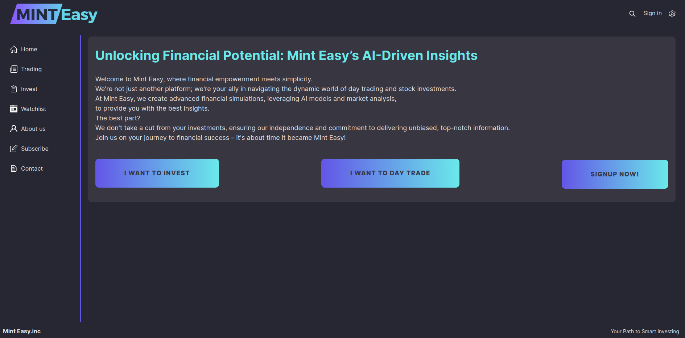

### Hi, I'm Holger 👋

As an experienced Python developer with over a year of professional experience, I possess excellent knowledge of backend development. My expertise spans monolithic, microservice, and serverless architectures. Much of my activity is within the realm of open source, where I actively contribute to various projects. My experiences in the open-source community have not only helped me continuously improve my skills but also fostered a broad understanding of best practices and development processes.

---

   
   

---

   

   📫 How to reach me: <a href='mailto:hdobosz@freenet.de'>hdobosz@freenet.de</a>

### Key Points

- **Professional Summary:** An aspiring Python developer with comprehensive training in various aspects of software development, including:
  - Fundamentals 
  - Python 
  - Databases 
  - Frameworks 
  - Application Programming Interfaces 
  - Cloud Services 
  - Final Capstone Project 
- **Language Skills:** Completed a language course in English. 
- **Achievements:** Successfully completed the final capstone projects "Mint Easy / Project X" as part of the training program.
- 
  <canvas id="myChart"></canvas>
    

## 🛠 Technology Stack

### Example for a  project

   

